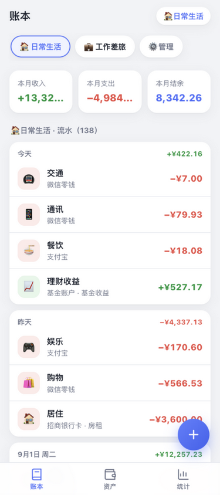
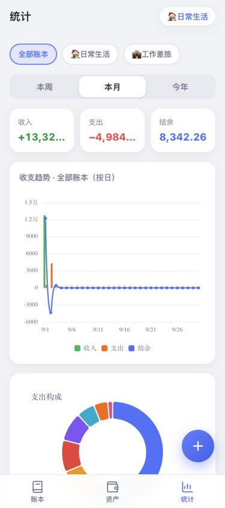
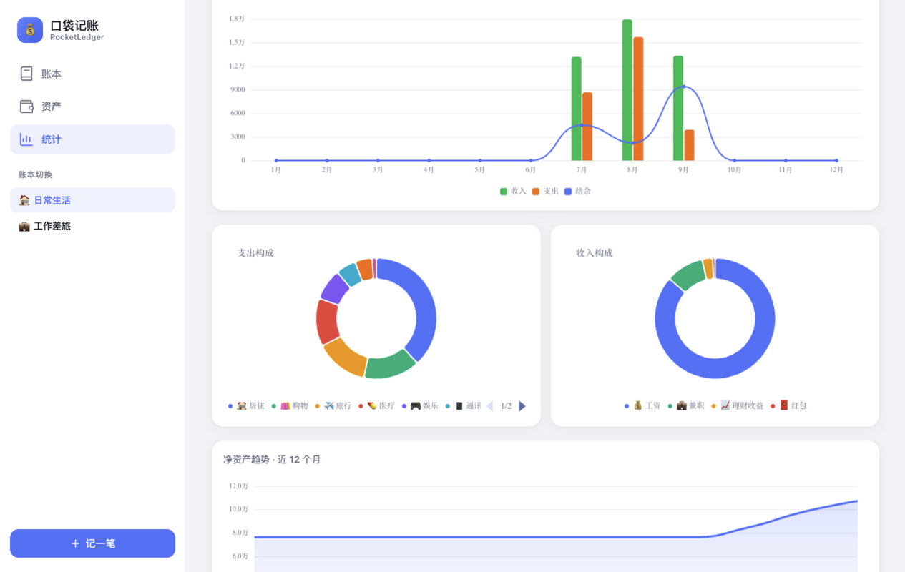

# 口袋记账 PocketLedger

一个**移动端优先、响应式布局**的开源记账本：**多账本记录 · 资产总览 · 收支统计图表**，纯前端零后端，数据全部存在本地浏览器。

> 本项目源于一次开源调研：市面上没有单一项目同时满足「多账本 + 资产/净资产 + 周/月/年统计图表 + 移动端响应式 Web + 轻量零部署」。调研对比了 10 个主流开源记账项目后，取各家之长实现了本仓库。完整调研见 [docs/开源项目对比分析.md](docs/开源项目对比分析.md)。

| 移动端 · 账本 | 移动端 · 统计 | 桌面端 · 统计 |
|---|---|---|
|  |  |  |

## 功能

### 📒 账本
- 多账本管理：新建 / 重命名 / 换图标颜色 / 删除（删除时连带清理账本内流水）
- 账本间数据独立，一键切换；侧边栏（桌面端）与顶部胶囊（移动端）均可快速切换
- 记一笔：支出 / 收入、金额、日期、账户、分类（emoji 分类墙）、备注
- 流水按日分组展示，显示当日净额；点击任意流水可编辑或删除

### 💰 资产
- 账户体系：资产账户（现金/银行卡/基金…）与负债账户（信用卡/贷款…）
- 净资产总览卡：净资产 = 总资产 − 总负债，实时联动每笔收支
- 全部收支记录：跨账本汇总视图，带账本标记，支持按收入 / 支出筛选
- 数据自主：一键导出 JSON 备份 / 导入恢复 / 重置演示数据

### 📊 统计
- 周期切换：**本周（按日）/ 本月（按日）/ 今年（按月）**
- 范围切换：全部账本或任一账本
- 收支汇总卡：收入 / 支出 / 结余
- 收支趋势图：收入与支出双柱状 + 结余折线（ECharts）
- 支出 / 收入构成环形图（Top 分类 + 其他）
- 净资产趋势图：近 12 个月逐月净值面积图

## 快速开始

```bash
npm install
npm run dev        # http://127.0.0.1:5173
```

生产构建与预览：

```bash
npm run build      # 类型检查 + 打包到 dist/
npm run preview    # http://127.0.0.1:4173
```

> 首次打开自动载入一套演示数据（以当天为基准生成），方便立刻体验所有图表；在「资产 → 数据管理」里可导出备份或重置。

## 技术栈

| 层 | 选型 | 说明 |
|---|---|---|
| 框架 | React 19 + TypeScript（strict） | Vite 7 构建 |
| 状态 | zustand + persist 中间件 | 数据持久化到 localStorage，零后端 |
| 图表 | Apache ECharts 6 | 独立 chunk 分包，ResizeObserver 自适应 |
| 样式 | 手写 CSS（设计变量 + 375px 移动优先） | 无 UI 框架依赖，安装即用 |

## 响应式设计

- **< 820px（手机）**：顶部标题栏 + 底部三 Tab 导航（账本/资产/统计）+ 悬浮记账按钮（FAB），弹窗呈底部抽屉样式，适配 `safe-area-inset` 刘海屏
- **≥ 820px（平板/桌面）**：左侧固定侧边栏（导航 + 账本切换 + 记一笔），隐藏 FAB 与 TabBar；统计页饼图自动变双列

## 数据与隐私

- 所有数据仅保存在**你自己的浏览器** localStorage 中，不上传任何服务器
- 「资产 → 数据管理」提供 JSON 导出 / 导入，可跨浏览器迁移
- 清空浏览器数据会清掉账本，请养成导出备份的习惯

## Roadmap

- [ ] PWA 离线缓存（manifest 已就绪，差 Service Worker）
- [ ] 深色模式
- [ ] 多币种与汇率
- [ ] 支付宝 / 微信账单 CSV 导入（参考 cashbook 的方案）
- [ ] 可选云同步（WebDAV / 自建服务）

## License

[MIT](LICENSE)
