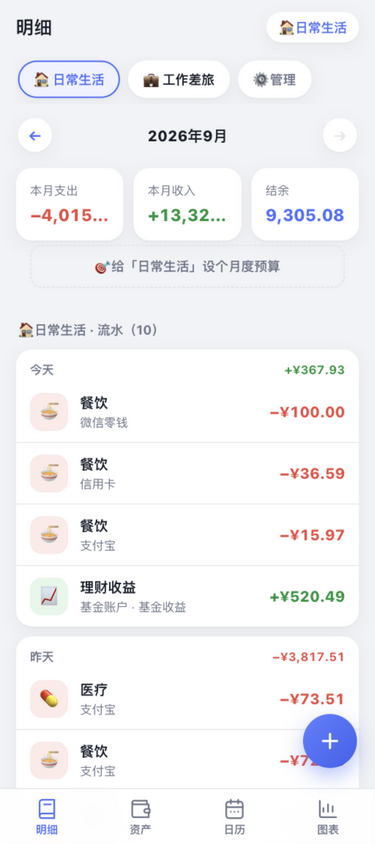
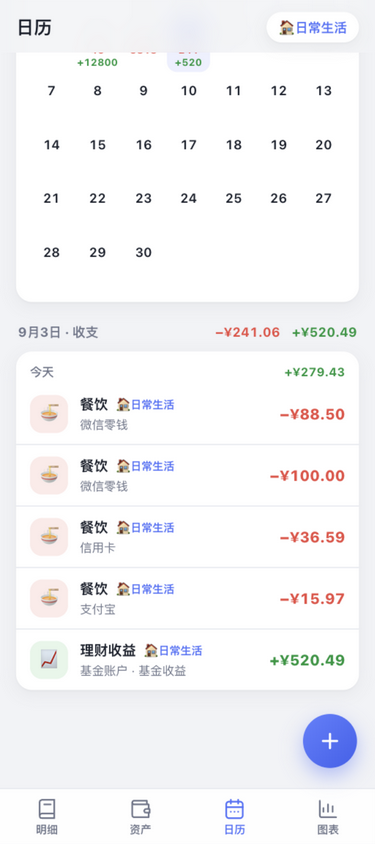
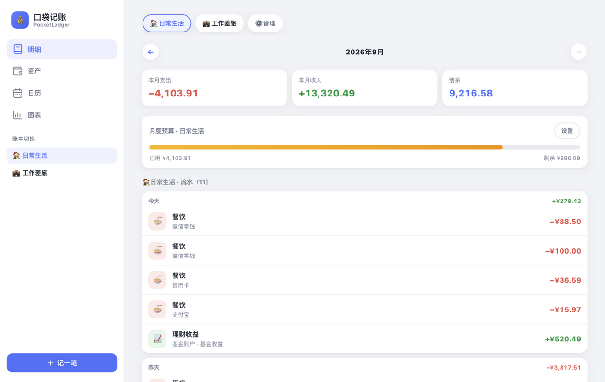
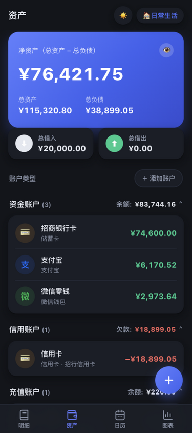
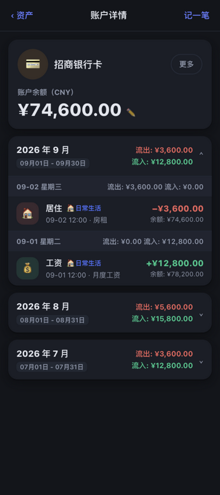
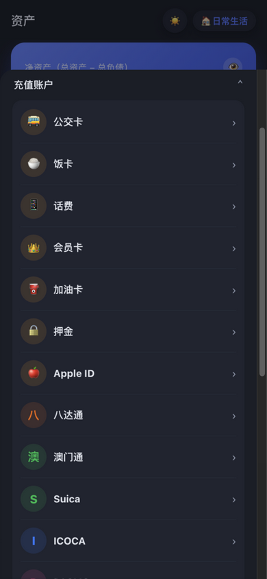

# 口袋记账 PocketLedger

一个**移动端优先、响应式布局**的开源记账本：**多账本明细 · 资产管理 · 收支日历 · 统计图表**，纯前端零后端，数据全部存在本地浏览器。

> 项目有两个设计来源：
> 1. **开源调研**：市面上没有单一项目同时满足「多账本 + 资产/净资产 + 周/月/年统计图表 + 移动端响应式 Web + 轻量零部署」，对比 10 个主流开源记账项目后取各家之长，见 [docs/开源项目对比分析.md](docs/开源项目对比分析.md)。
> 2. **iCost 记账**（[icostapp.com](https://icostapp.com/)）：本人日常在用的 iOS 记账 App，交互与视觉标杆。已对齐其信息架构（明细/资产/日历/图表四栏）与核心交互（数字键盘记账、月份切换、收支日历、环形图中心总额等），并按其功能清单制定了分期实现计划，见 [docs/icost-设计基准.md](docs/icost-设计基准.md)。

| 移动端 · 明细 | 移动端 · 键盘记账 | 移动端 · 日历 | 桌面端 · 明细 |
|---|---|---|---|
|  |  |  |  |

| 移动端 · 资产分组 | 移动端 · 账户详情 | 移动端 · 借入借出 | 移动端 · 选择账户类型 |
|---|---|---|---|
|  |  |  |  |

## 功能

### ⌨️ 快速记账（iCost 式数字键盘）
- 底部抽屉面板：大字金额实时显示（支出红 / 收入绿 / 转账蓝）
- 分类宫格一键选择，账本 / 账户胶囊快捷切换
- 计算器数字键盘（⌫ 退格 / C 清空 / 完成），支持两位小数
- 「更多」展开日期与备注；编辑已有记录共用同一面板
- **⭐ 存为模板**：常用账单保存为模板，明细页一键再记
- **🔁 转账**：账户间划转，双向更新余额、不影响净资产

### 📒 明细（多账本记账）
- 多账本管理：新建 / 重命名 / 换图标颜色 / 删除，账本间数据独立
- **月份切换器**：← 上月 / 下月 →，查看任意月份的账单
- 月度汇总：支出 / 收入 / 结余 三卡实时联动
- **月度预算**：按账本设置预算，进度条实时显示已用 / 剩余，超支红色告警
- **模板芯片**：点击模板一键进入预填记账面板
- **周期记账**：每天 / 每周 / 每月 / 每年规则，启动时自动补齐账单（幂等、防重复）
- **账单搜索**：关键词 + 类型/账本/账户/标签/日期/金额/报销多维筛选，带命中汇总
- 流水按日分组、显示当日净额；**标签与报销徽标**；点击任意流水可编辑或删除
- **全部收支记录**：跨账本汇总列表，带账本标记，按收入 / 支出 / 转账筛选

### 🌓 主题
- **深色 / 浅色主题一键切换**（顶栏或侧边栏 🌙/☀️ 按钮），选择持久化
- 全部内容适配：卡片、表单、键盘、日历、弹窗、徽标均随主题变色
- **ECharts 图表深度适配**：坐标轴、网格线、图例、环形图描边与中心文字、悬浮提示框全部随主题切换，深色下自动提亮主色保证对比度

### 💰 资产（对齐 iCost 账户体系）
- **六大账户类型**：资金账户 / 信用账户 / 充值账户 / 理财账户 / 应收账户 / 应付账户，65 个子类型（储蓄卡、支付宝、微信钱包、花呗、公积金、公交卡、股票、黄金、借出、借入…），品牌色圆标图标
- **分组折叠展示**：每组标题右侧实时汇总「余额 / 欠款」，账户行 = 彩色圆标 + 名称 + 子类型/备注 + 余额
- **净资产总览**：净资产 = 总资产 − 总负债，实时联动每笔收支；**总借入 / 总借出** 两卡直达借贷列表
- **借入 / 借出**：分段切换列表，记录对方、备注与**借款时间**；借出与借入均为独立账户，还款用转账即减欠款
- **账户详情页**：点账户进入 —— 账户卡（更多菜单修改/删除、✏️ 余额调整）+ **按月折叠的收支流水**：月/日 流出流入汇总、每笔之后的账户余额、转账路线、「账户创建」条目，右上角「记一笔」直达本账户记账
- **账单详情页**：点流水进入 —— 编辑 / 删除 / 退款 / 存为模板快捷操作，备注、标签、报销状态、退款关联均可页内直接修改
- **余额调整计算器**：带入当前余额、清除按钮、+−×÷ 四则运算键盘，可选「将增减金额记为收支」
- **账户开关**：`计入总资产`（关闭后不计入净资产与汇总，显示「不计入」徽标）、`记账时可被选择`（关闭后不出现在记账/转账/周期账户列表）
- **隐私模式**：👁 一键隐藏全部金额（¥✱✱✱✱）
- 数据自主：JSON 导出备份 / 导入恢复 / 重置演示数据

### 📅 收支日历
- 月历视图：每格显示当日支出（红）/ 收入（绿）金额
- 点选任意日期，下方展示当日流水与收支合计
- 支持全部账本或单账本筛选

### 📊 图表（统计）
- 周期切换：**本周 / 本月 / 今年 / 全部**（周/月/年均可用箭头前后切换）
- 范围切换：全部账本或任一账本
- 收支统计卡：支出 / 收入 / 结余 / **日均支出**
- 收支趋势图：收入与支出双柱状 + 结余折线（全部与今年按月聚合）
- 支出 / 收入构成环形图：**中心显示总额**，外侧标注「分类 · 百分比」
- 净资产趋势图：近 12 个月逐月净值面积图

## 快速开始

```bash
npm install
npm run dev        # http://127.0.0.1:5173
```

生产构建与预览：

```bash
npm run build      # 类型检查 + 打包到 dist/
npm run preview    # http://127.0.0.1:4173
```

> 首次打开自动载入一套演示数据（以当天为基准生成），方便立刻体验所有图表；在「资产 → 数据管理」里可导出备份或重置。

## 技术栈

| 层 | 选型 | 说明 |
|---|---|---|
| 框架 | React 19 + TypeScript（strict） | Vite 7 构建 |
| 状态 | zustand + persist 中间件 | 数据持久化到 localStorage，零后端 |
| 图表 | Apache ECharts 6 | 独立 chunk 分包，ResizeObserver 自适应 |
| 样式 | 手写 CSS（设计变量 + 375px 移动优先） | 无 UI 框架依赖，安装即用 |

## 响应式设计

- **< 820px（手机）**：顶部标题栏 + 底部四 Tab 导航（明细/资产/日历/图表）+ 悬浮记账按钮（FAB），弹窗呈底部抽屉样式，适配 `safe-area-inset` 刘海屏
- **≥ 820px（平板/桌面）**：左侧固定侧边栏（导航 + 账本切换 + 记一笔），隐藏 FAB 与 TabBar；统计页饼图自动变双列

## 数据与隐私

- 所有数据仅保存在**你自己的浏览器** localStorage 中，不上传任何服务器
- 「资产 → 数据管理」提供 JSON 导出 / 导入，可跨浏览器迁移
- 资产页右上角 👁 可进入隐私模式隐藏金额
- 清空浏览器数据会清掉账本，请养成导出备份的习惯

## Roadmap（对齐 iCost 功能清单，分批实现）

- ~~**第二批（交互增强）**：转账、模板快捷记账、周期记账~~ ✅ 已完成
- ~~**第三批（搜索/标签/报销/退款）**：账单搜索与多维筛选、标签系统、报销标记、退款关联~~ ✅ 已完成
- ~~**深色主题**：全内容与图表适配~~ ✅ 已完成
- ~~**账户类型体系（对齐 iCost 资产模块）**：六大账户大类 + 65 子类型、账户详情页、借入/借出~~ ✅ 已完成
- **第三批收尾**：二级分类、组合付款
- **第四批（数据与平台）**：支付宝 / 微信 CSV 导入、多币种、WebDAV / 自建云同步、存钱计划
- **第五批（体验深化）**：PWA 离线、深色模式、记账图片与位置、年度总结报告

详见 [docs/icost-设计基准.md](docs/icost-设计基准.md) 的完整映射表。

## License

[MIT](LICENSE)
